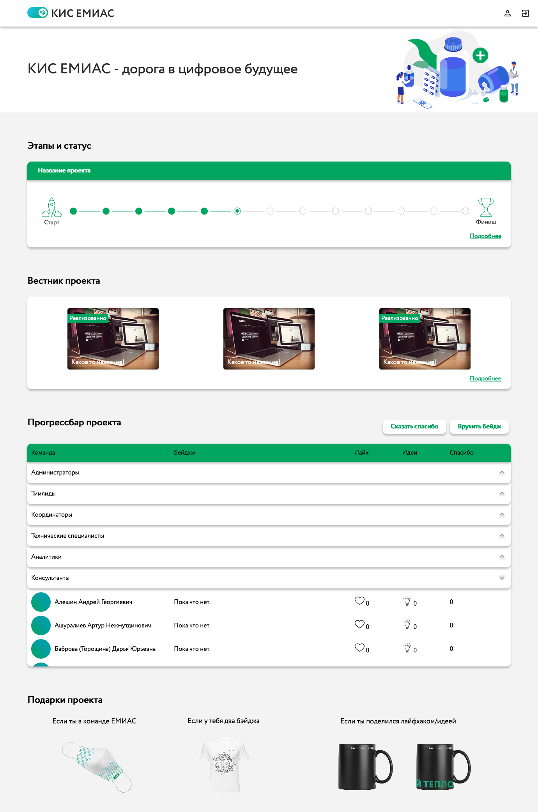
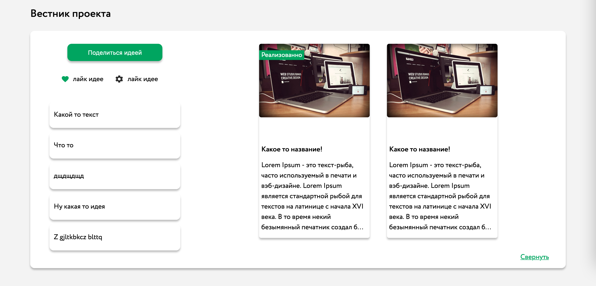
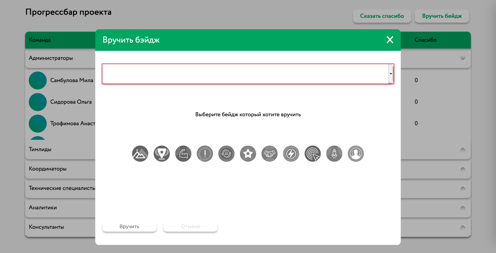
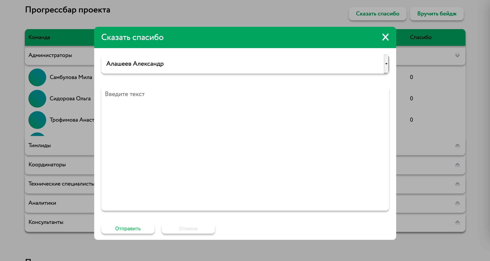
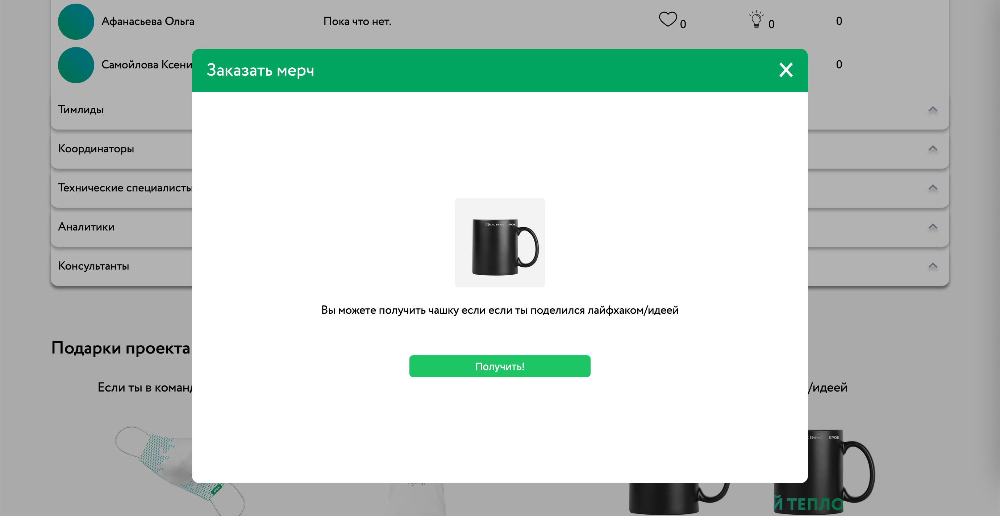
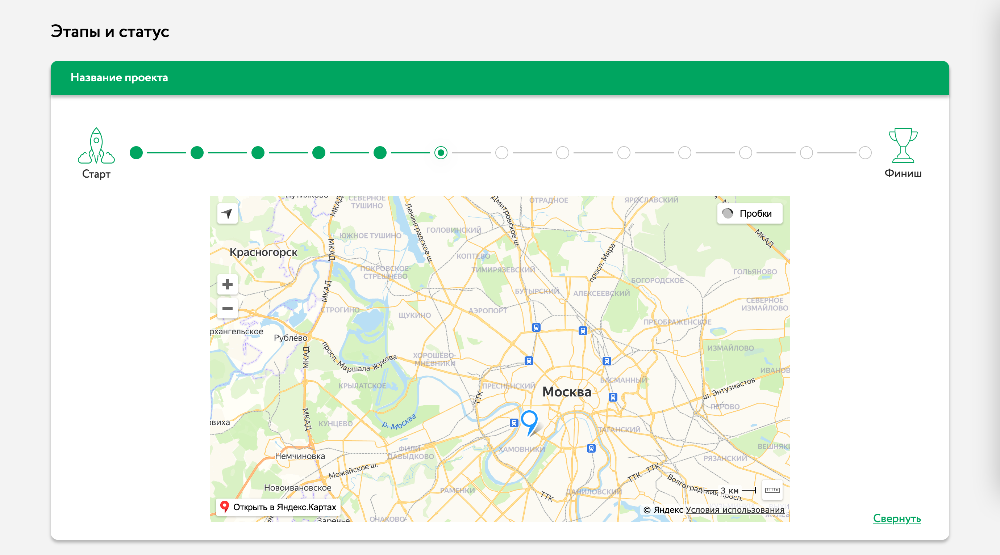
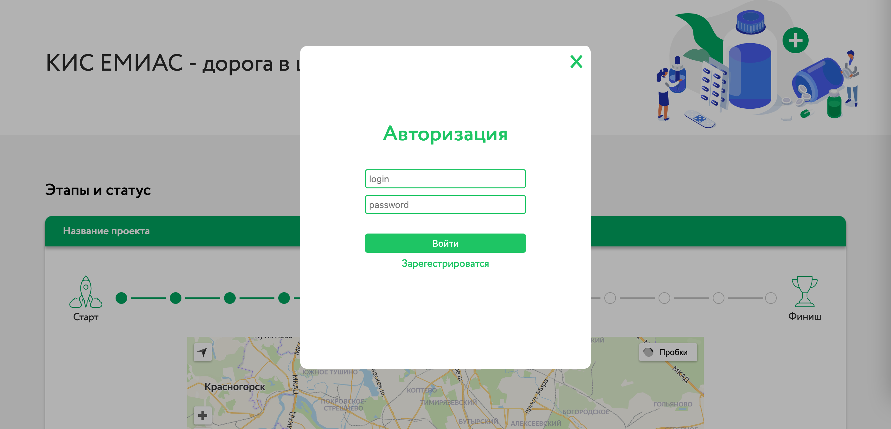
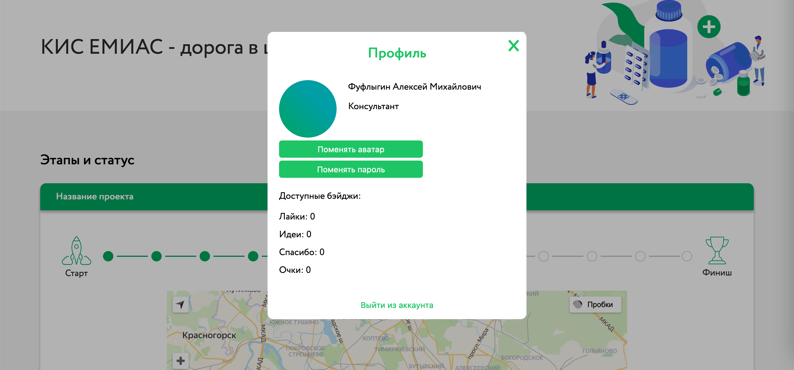
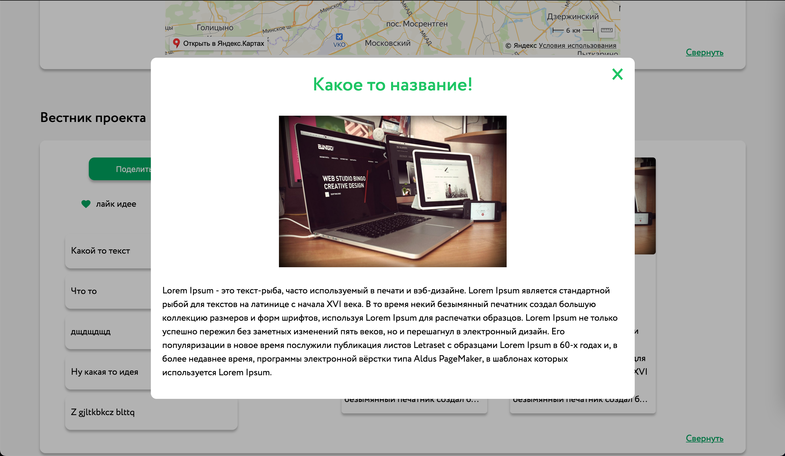

# EMAIS-Front

> Проект созданный на Vue, для сroc

## Установить все необходимые пакеты 
```sh
npm install # или: yarn
```

### Для того что бы запустить проект для разработки

```sh
npm run serve # или: yarn serve
```

### Для того что бы сбилдить проект нужно:
```sh
npm run build # или: yarn build
```

Скриншоты:


Вся страница:

Блок "вестник" в раскрытом состоянии

Модальное окно вручение бейджа

Модальное окно "Сказать спасибо"

Модальное окно "Получить мерч"

Блок "Этапы и статус в развёрнутом виде"

Авторизация

Профиль

Окно которое появляется при нажатии на какую то новость.

